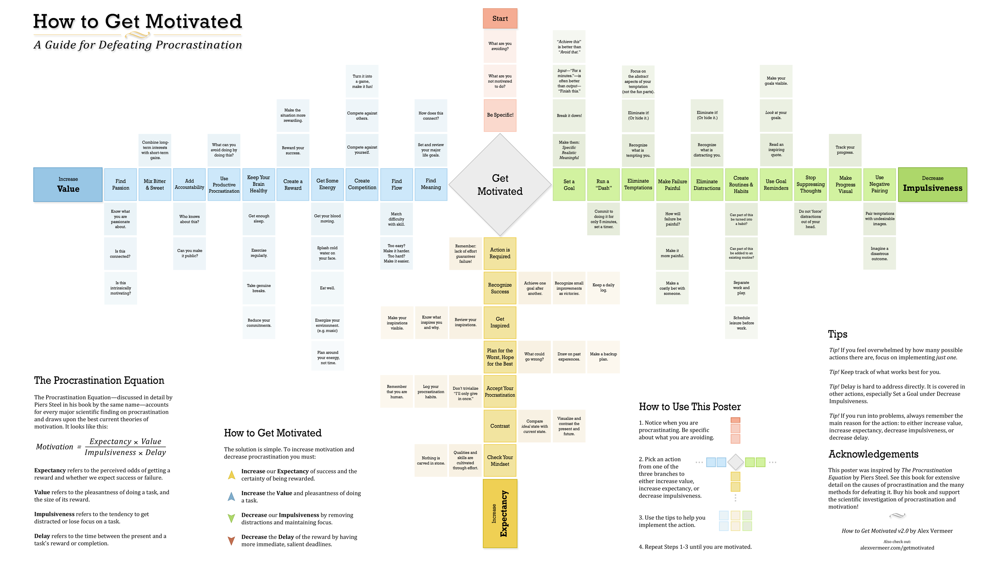

# Design systems that align emotions with cognitions
This is essentially modulating [[Motivational Intensity]] (the emotion) to fit with what we find most important (the cognition) – [[Set goals effectively]].

What does this mean, then? It means to: 
* [[Design systems that support valuing its actions]], 
* [[Design systems that decrease impulsiveness]]
* [[Design systems that support expectancy]] 

From [[The Motivation Equation]]:

How similar is this to OIT? [[OIT is about cognitions, not emotions]]. This is important, because it determines whether “how to integrate motivations” from Roam can be used to inform which systems to design here.

This is essentially two problems; clarify cognitions, select them, and implement systems that motivate emotions in the same direction.

<!-- #p1 #life/project/0. raw# -->
---
Q. You notice your emotions are poorly aligned with your cognitions. What materials have you collected for re-alignment?
A. [[The Motivation Equation]], 

## Backlinks
* [[Align emotions and cognitions]]
	* [[Design systems that align emotions with cognitions]]
* [[Motivational Intensity]]
	* For more, look up the motivation equation. For how to change it, [[§Increasing motivational intensity]] and [[Design systems that align emotions with cognitions]]. 
* [[§Systems Thinking]]
	* [[Design systems that align emotions with cognitions]]
* [[What works with complice and what doesn’t]]
	* Ie. how does it inform [[Design systems that align emotions with cognitions]]? #p1

<!-- {BearID:57DE9AF7-139C-431D-A301-9F709F95655B-3501-00000565385AB80B} -->
