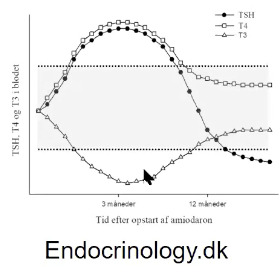

# Hyperthyreose (for udredning, se Thyrotoxikose)
[[Thyrotoxikose]] der skyldes produktion i gl. thyroidea.

[[Subklinisk hyperthyreose]]

Q. Hvordan adskiller [[Hyperthyreose]] sig fra [[Thyrotoxikose]]?
A. [[Thyrotoxikose]] er forhøjet T3/T4, [[Hyperthyreose]] er [[Thyrotoxikose]] pga. produktion i gl. thyroidea.

## Backlinks
* [[Osteoporose]]
	* Q. Hvilke årsager til [[Osteoporose]] er reversible?
	* Q. Hvilke endokrine  *risikofaktorer* findes til [[Osteoporose]]?
* [[Thyrotoxikose]]
	* Hvis det skyldes produktion i gl. thyroidea kaldes det [[Hyperthyreose (for udredning, se Thyrotoxikose)]].
* [[Subklinisk hyperthyreose]]
	* Asymptomatisk [[Hyperthyreose (for udredning, se Thyrotoxikose)]] (-TSH, normal T3/T4)
* [[Thyroideasygdom (fortolkning af blodprøver)]]
	* [[Hypothyreose (myxødem)]]
	[[Subklinisk hyperthyreose]]
* [[Amiodaron]]
	* Q. Hvordan adskilles ved [[Amiodaron]] normal fra abnorm thyroideapåvirkning?

* [[PCOS]]
	* [[Akromegali]], [[Hyperprolaktinæmi]],  [[Hyperthyreose (for udredning, se Thyrotoxikose)]], [[Hyperthyreose (for udredning, se Thyrotoxikose)]], [[Cushing’s syndrom]], [[Primær hypogonadisme]]
	* [[Akromegali]], [[Hyperprolaktinæmi]],  [[Hyperthyreose (for udredning, se Thyrotoxikose)]], [[Hyperthyreose (for udredning, se Thyrotoxikose)]], [[Cushing’s syndrom]], [[Primær hypogonadisme]]
* [[Non-parathyroid hypercalcæmi]]
	* Q. Hvad er de primære årsager til [[Hypoparathyroid hypercalcæmi]] på hospital?

<!-- #anki/tag/med/Endocrinology #anki/deck/Medicine -->

<!-- {BearID:0C6E673C-9371-4E1C-8B5E-F9525C666D18-21575-00002B0244E149A5} -->
