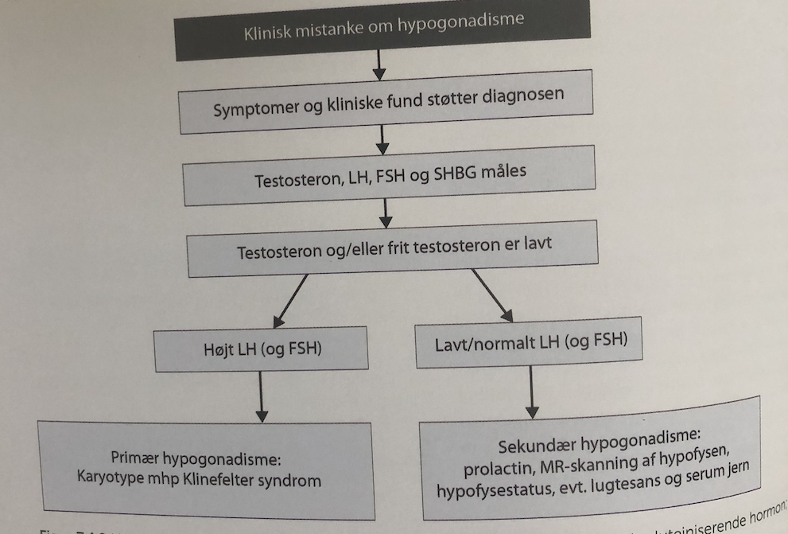

# Hypogonadisme
## Generelt
Q. Hvordan opdeles [[Hypogonadisme]] hos mænd?
A. [[Primær hypogonadisme]] og [[Sekundær hypogonadisme]].

## Differentialdiagnose
Q. Hvordan adskiller man biokemisk 1) [[Primær hypogonadisme]] fra 2) [[Sekundær hypogonadisme]]?
A. Primær har forøget [[LH]]-sekretion, sekundær har nedsat eller normal [[LH]]-sekretion

## Udredning

Q. Hvad er *symptomerne* på [[Hypogonadisme]] i mænd?
A. 1) Nedsat motivation og energi, 2) Nedsat libido, 3) Færre spontane erektioner

Q. Hvad er de objektive fund ved [[Hypogonadisme]] i mænd?
A. 1) Tab af kropsbehåring, 2) Gynækomasti, 3) Små testikler

Q. Hvordan stilles diagnosen [[Hypogonadisme]] hos mænd?
A. Klinik + måling af [[Testosteron]] og [[LH]] om morgenen.

## Behandling

## Opfølgning

## Prognose

## Backlinks
* [[FSH]]
	* Q. Hvad er symptomerne på *hypo*sekretion af [[FSH]] i mænd? 
Dvs. svarende til [[Hypogonadisme]].
* [[Træthed]]
	* Q. Hvilke *endokrine* differentialdiagnoser findes især til [[Træthed]]?
* [[Hypogonadisme]]
	* Q. Hvordan opdeles [[Hypogonadisme]] hos mænd?
	* Q. Hvad er *symptomerne* på [[Hypogonadisme]] i mænd?
	* Q. Hvad er de objektive fund ved [[Hypogonadisme]] i mænd?
	* Q. Hvordan stilles diagnosen [[Hypogonadisme]] hos mænd?

<!-- #anki/tag/med/Endocrinology #anki/deck/Medicine -->

<!-- {BearID:B532776F-F63E-439D-8A1D-65A619F156F5-21575-0000269D67316627} -->
