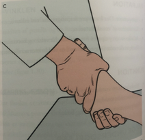

# Undersøgelse af fod
[Undersøgelsesvideoer til studerende - Ortopædkirurgi - Aarhus Universitetshospital](https://www.auh.dk/afdelinger/ortopadkirurgi/til-fagfolk/undersogelsesvideoer)

[[§Fod]], [[§Ankel]].

## Generelt

## Stand
1. Hulfod/platfod
	1. [[Too many toes sign]]
	2. [[Peeking heel sign]]
2. Stand på tæer
	1. Hælen skal gå i varus
		1. Tibialis post.
		2. Achilles

Varus/valgus

## Gang
1. Normal
2. Tæer
3. Hæle

## Liggende
1. Generelt
2. Tæer
	1. Storetå, fleksion og ekstension
		1. Ekstension 70 grader
		2. Fleksion, 40 grader
3. Fod
	1. Inspektion
		1. Hård hud under fod
		2. Hævelse/deformitet af foden
	2. Palpation
	3. Funktion
		1. Passiv/aktiv mobilitet
			1. Fleksion/ekstension
			2. Inversion/eversion (pt. holder fod stille, læge forsøger at rotere)
				1. Uden hæl fikseret
				2. Med hæl fikseret, angives som fraktion af bevægelse i modsidige
		2. Sensibilitet
		3. Test 
4. Ankel
	1. Funktion
		1. Lad pt. hjælpe til ved fleksion
		2. Ved ekstension, er ankelleddet baseret på vinklen fra hælen (forfoden bøjer også med)
5. Sko
	1. Slidmønster

Q. Hvordan vil du undersøge indirekte ømhed af en ankel?
A. Få patienten til at sidde. Tryk nedad på knæ.

Q. Hvor mange grader kan raske talocruralled *plantarflektere*? 
A. 20

Q. Hvor mange grader kan raske talocruralled *dorsiflektere*? 
A. 40

Q. Du skal vurdere dorsiflektion i et talucruralled. Hvilket håndgreb bør gøres?
A. Calcaneus bør fikseres, se billede.

Q. Hvor mange grader kan raske subtalærled *invertere*? 
A. 20

Q. Hvor mange grader kan raske subtalærled *evertere*? 
A. 20

## Backlinks
* [[§Ankel]]
	* [[Undersøgelse af fod]]
[[Peeking heel sign]]
* [[§Fod]]
	* [[Undersøgelse af fod]]

<!-- #anki/tag/med/Orto #anki/deck/Medicine -->

<!-- {BearID:5146B7E7-B677-4B01-BD36-E2786A252A27-53319-00006C175D2027C5} -->
